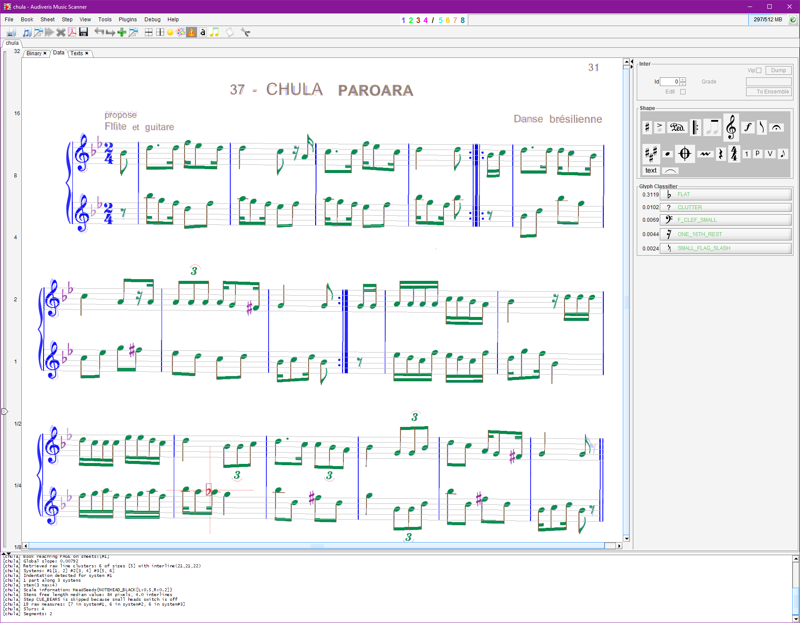

# Main window

This is the window that appears when Audiveris is run in the interactive mode
(which is the standard mode, unless the `-batch` option is specified on the command line).

From this central window, we can drive the transcription process and edit the results.

This main window is composed of 3 panels: sheet, boards and events.

## Sheet

This is the large panel on the left side.  
- The **Gray** tab, when available, presents the original image using gray values.
- The **Binary** tab presents the input image binarized into black and white colors.
- The **Data** tab presents the objects
([sections](../main_concepts/run_section.md#section-and-lag), [glyphs](../main_concepts/glyph_inter.md#glyph) and
[inters](../main_concepts/glyph_inter.md#inter)) extracted from the image.
In this `Data` tab, the staff lines are logically removed and drawn as thin lines.

All tabs, except the `Data` tab, can be manually closed.
Most can be re-opened via the `Sheet` pull-down menu.

## Boards

The right panel is a vertical set of boards.
They provide information and editing functions.

Only basic boards are displayed by default, the others are hidden.
A right click in this column allows to hide or display any board
available for the current sheet tab.

## Events

The lower panel is a log of the main events that occurred so far.

More details are available in the Audiveris log file
(the precise path to the log file is displayed at the top of this events panel).
