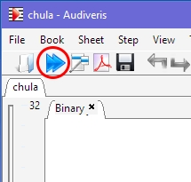

# Transcribe

Transcription is the heart of OMR, the difficult process to infer high-level music information
from low-level graphical data.

This process can be launched directly from the toolbar icon:

It can also be launched via the pull-down menu {{ site.book_transcribe }}:

This command applies to all images (sheets) in the input file (book).

There is also the pull-down menu {{ site.sheet_transcribe }} which applies only to the current sheet.
In the simple case at hand, since we have just one image in the input file, the book-level and
sheet-level commands are equivalent.

After some time, we get the following image of transcribed music:

Looking carefully at this result, we might detect a couple of mistakes:
- On the upper left, the word "Flûte" was OCR'd as "Flfite" [^flute]
- On the lower left, a flat sign was not recognized [^flat]
- On the lower right, a quarter rest was not recognized[^quarter]

This could easily be corrected by manual actions, but let us simply ignore them
for now to keep this example short.

[^flute]: This is a French word, while the OCR language is English by default. See {{ site.tools_languages }}  
[^flat]: The underlying glyph collides with a ledger, resulting in poor grade.  
[^quarter]: This is due to an overlap with a flag item.